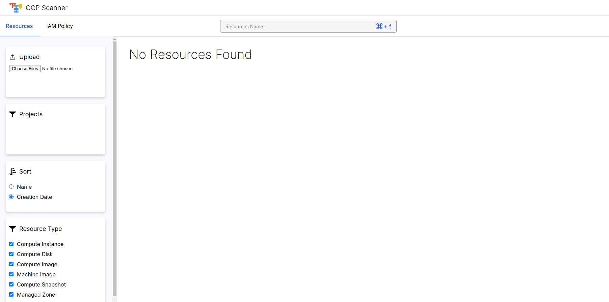
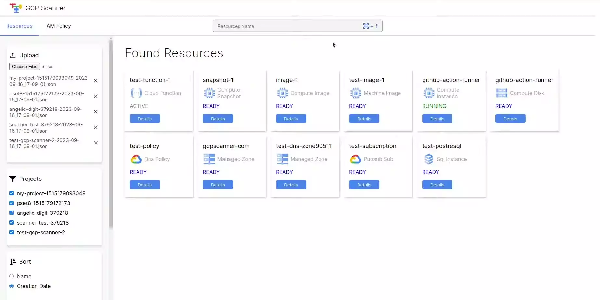
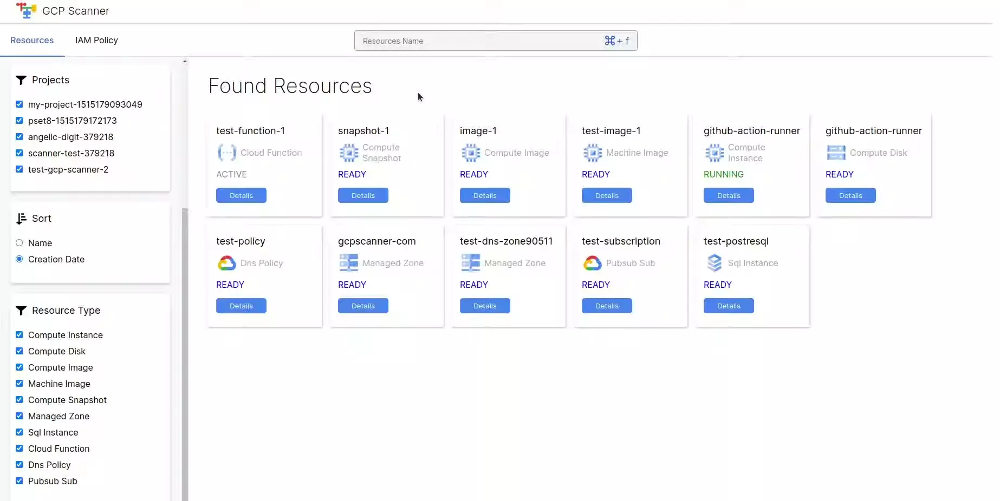
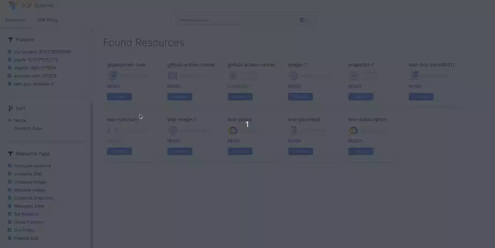
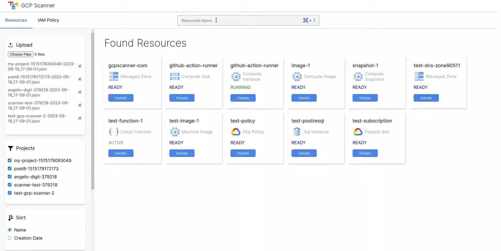

# GCP Scanner Visualizer Usage Guide

The GCP Scanner Visualizer is a web-based tool that can help you visualize the results of the GCP Scanner.

## Running the tool

To run the tool, you can use the following command `gcp-scanner-visualizer`. The tool will start a web server on port 8080. You can change the port by using the `-p` option.

Then you can open your browser and navigate to `http://localhost:8080` to use the tool.

## Uploading the results

To upload the results, head to the `Upload` Section and click on the `Choose File` button. Then choose the JSON file that you want to upload. Note that you can upload multiple files at once.

After uploading the result file, the tool will scan the file and append the results to UI.

You can also remove any file by clicking on the `minus` icon next to the file name.

## Viewing the results

There are two main pages in the tool:

### Resources Page

This is the main page and it shows the list of resources that were found in the result file. You can click on the `Details` button to see more details about the resource.

#### Sorting and filtering resources

You can sort the shown resources by their name or creation time. By default, the resources are sorted by their creation date in descending order and you can change the sorting type from the `Sort` Section on the left menu.

The tool provides several options to filter the resources. You can filter the resources by:

- Project
- Resource Type

#### Searching for resources

We have two convenient methods to search for resources:

- Normal Search

You can search for resources by their name in the search bar. The tool will show the resources that contain the search term in their name.

- Regular Expression Search

You can search for resources by providing a valid regular expression of the resource name in the search bar. The tool will show the resources that matches the expression.

### IAM Policy Page

This page shows the list of IAM policies that were found in the result file. The policies are visualized in a table view with each row represents a single role. The roles are grouped by the project that they belong to.

To see the members of a role, you can click on the icon next to the role name to expand the role.

#### Searching for IAM policies

We have two convenient methods to search for member in IAM policies:

- Normal Search

You can search for a member in the IAM policies by using the search bar. The tool will show the policies that contain the email address of the member in the search bar.

- Regular Expression Search

You can search for resources by providing a valid regular expression of the member email in the search bar. The tool will show the policies that matches the expression.

